# Отчёт о выполнении лабораторной работы №1 Установка и конфигурация операционной системы на виртуальную машину
***Российский Университет Дружбы Народов***  
***Факульткт Физико-Математических и Естественных Наук***  

 ***Дисциплина:*** *Операционные системы*  
 
 ***Работу выполняла:*** *Адоле Фейт*  
 
 *1032205074*  
 
 *НПМбд-01-20*  
 
 ***Москва. Дисплейный класс РУДН. 2021г.*** 
 ## Цель работы 
Целью данной работы является приобретение практических навыков установки опера-
ционной системы на виртуальную машину, настройки минимально необходимых для
дальнейшей работы сервисов.
## Задание 
1. Скачать виртуальную машину.
2. Создать виртуальную машину.
3. Настроить виртуальную машину.
## Выполнение работы
1. Скачала приложение VirtualBox. 
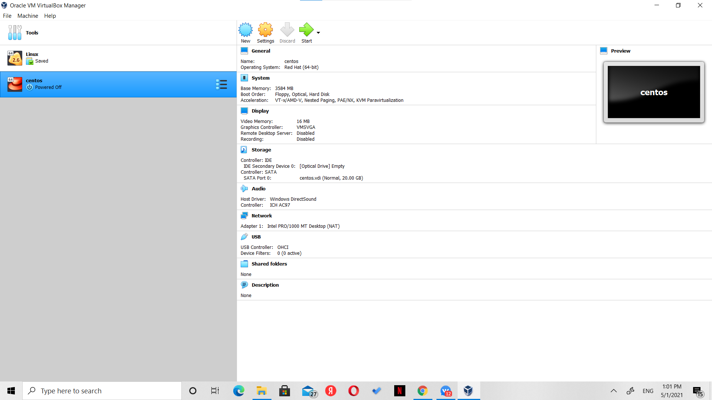
2. Настроила необходимые параметры.  
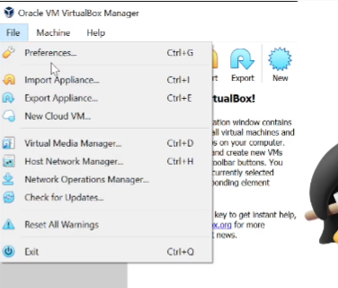 
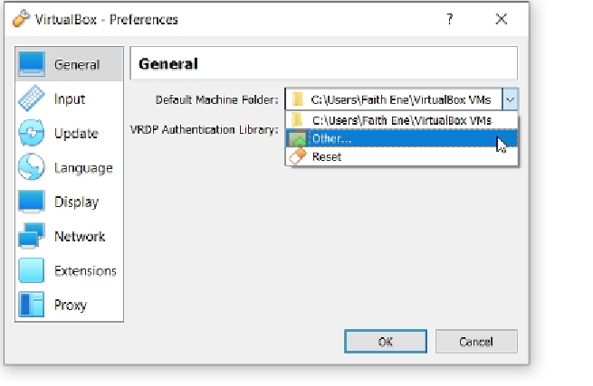
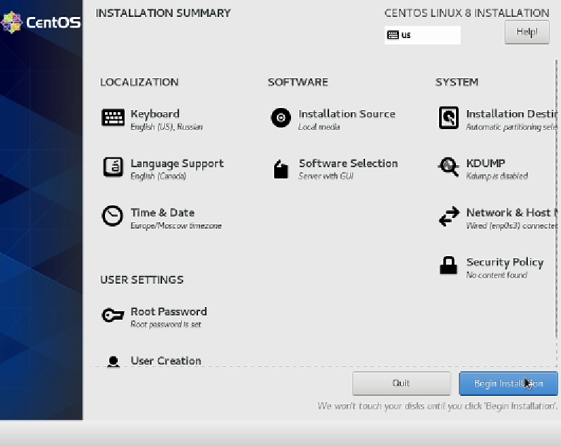
3. Зарегестрировалась и запустила машину.  
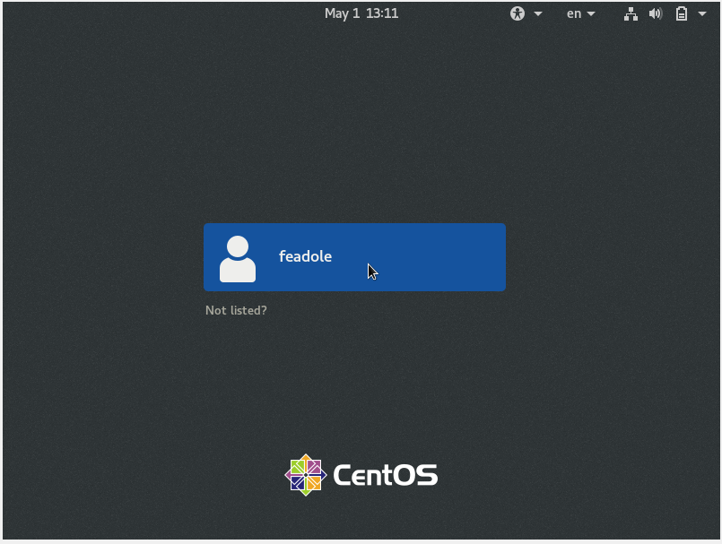  
## Домашнее задание
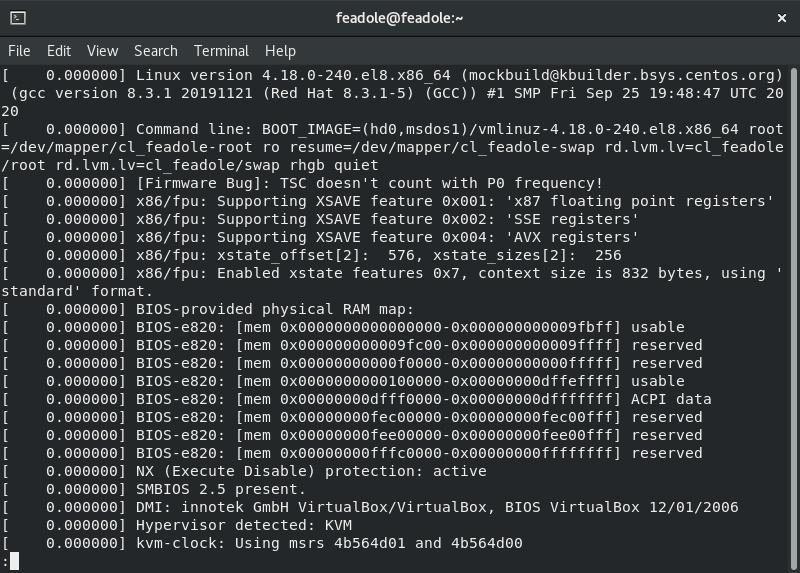
Получила следующую информацию.
1. Версия ядра Linux (Linux version).
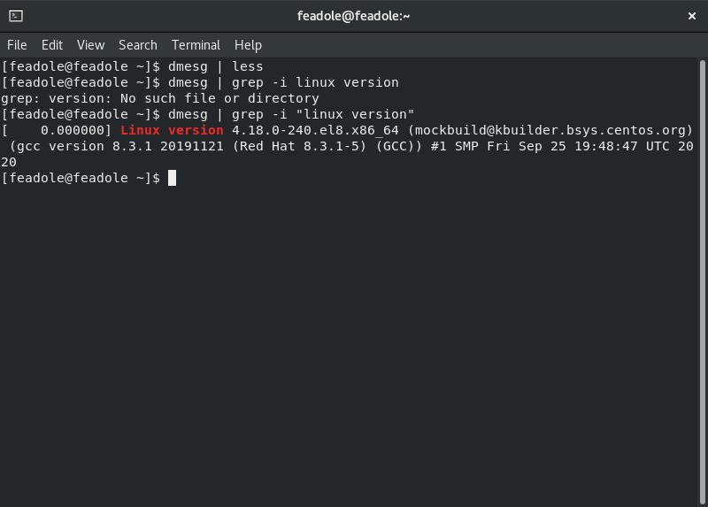
2. Частота процессора (Detected Mhz processor).
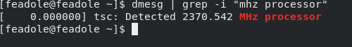
3. Модель процессора (CPU0).
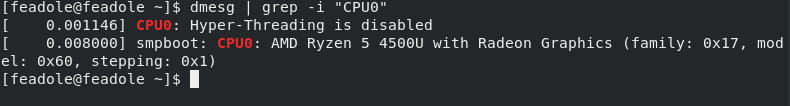
5. Объем доступной оперативной памяти (Memory available).
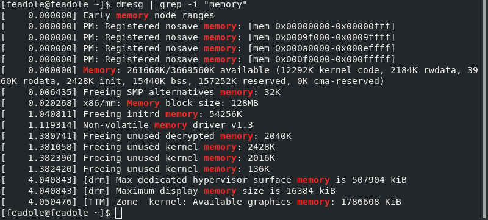
5. Тип обнаруженного гипервизора (Hypervisor detected).
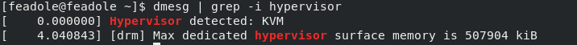
6. Тип файловой системы корневого раздела.
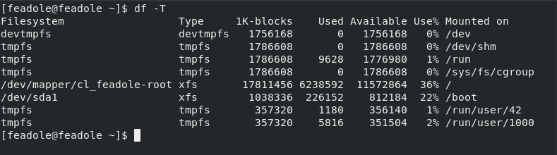
7. Последовательность монтирования файловых систем.
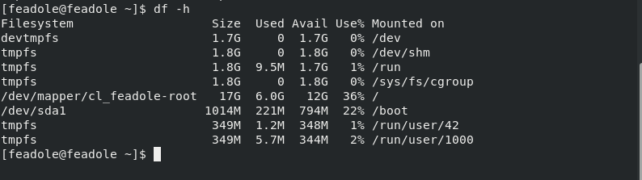
## Контрольные вопросы 
1. Учетная запись польщователя хранит
Системное имя (user name)
Идентификатор пользователя (UID)
Идентификатор группы (GID)
Домашний каталог (home directory)
2. Команды терминала:
Для получения справки по команде используется флаг --help или -h, например cd --help

Для перемещения по файловой системе используется команда cd, например cd downloads - перемещение в каталог "downloads" cd .. - перемещение в корневой каталог

Для просмотра содержимого каталога используется команда ls

Для определения объема каталога используется команда du Для удобства лучше использовать с ключами -s и -h например du -hs /downloads

Чтобы создать файл или каталог, используются команды touch и mkdir соответственно например touch text.txt, mkdir downloads2 
Чтобы удалить файл или каталог, используются команды rm и rmdir соответственно например rm text.txt, rmdir downloads2

Для создания и редактирования прав файла/каталога используют chmod например chmod 777 text.txt

Для просмотра истории команд используют history

3. Файловая система - это порядок, определяющий организацию, структуру, хранение и именование на определенном логическом носителе Примеры наиболее распространенных файловых систем: NTFS, FAT32, exFAT

4. Узнать, какие ФС смонтированы в ОС, можно узнать с помощью команды mount

5. Можно использовать команду kill 
## Вывод
> Приобрела практические навыкы установки операционной системы на виртуальную машину, настройки минимально необходимых для
> дальнейшей работы сервисов. Успешно установила и настроила виртуальную машину Linux.
