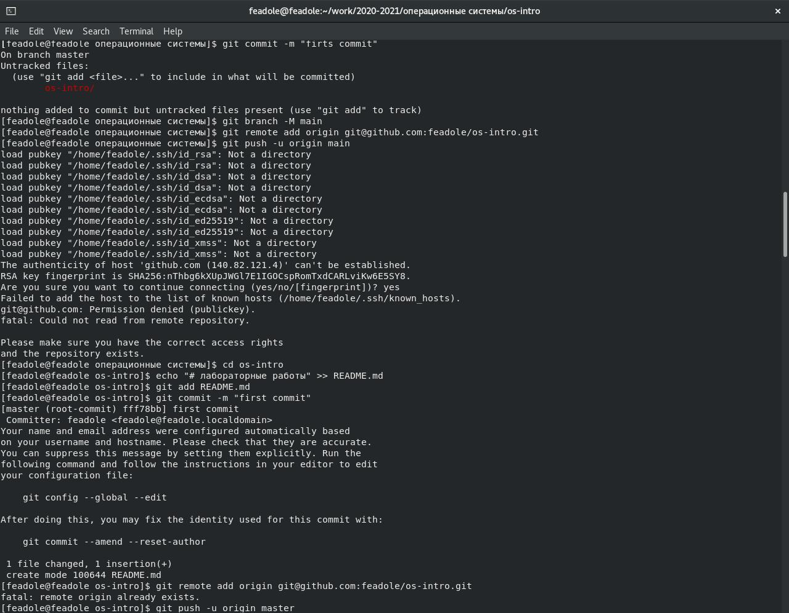
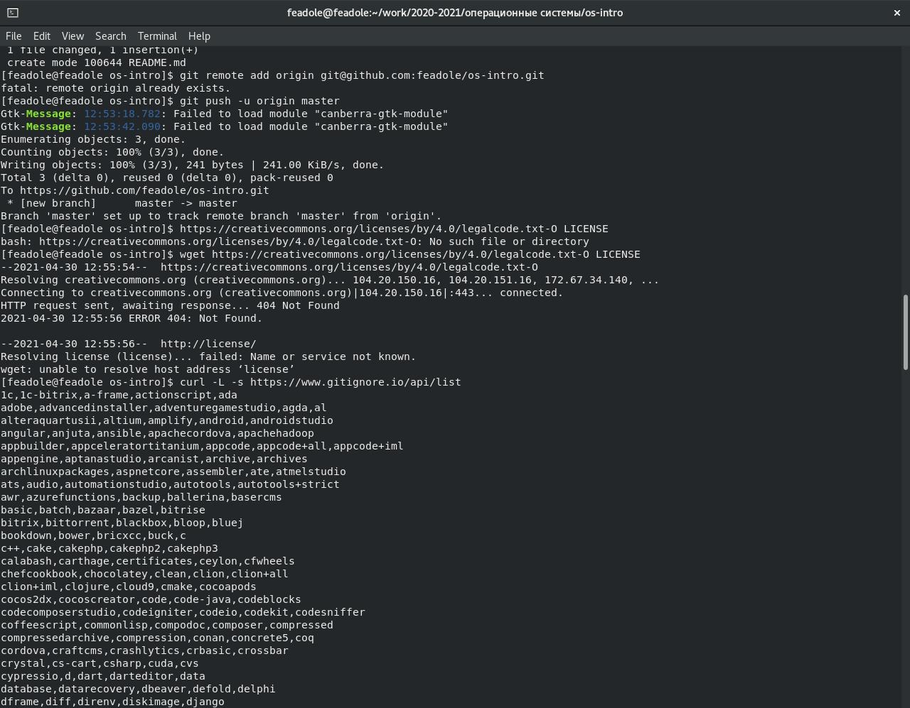
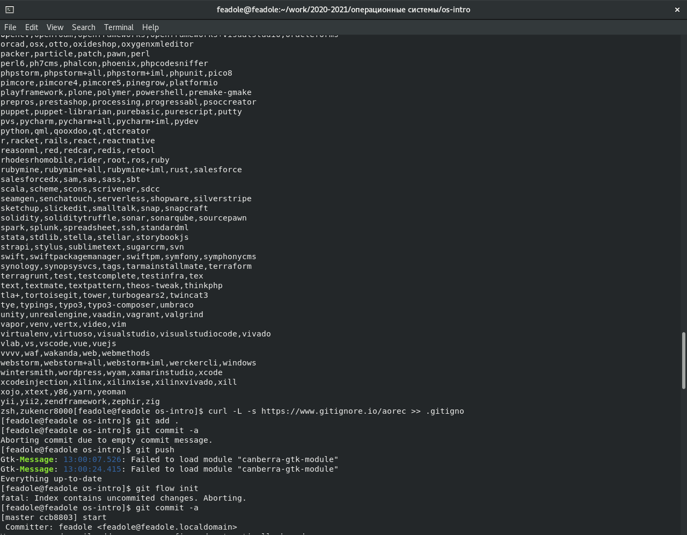
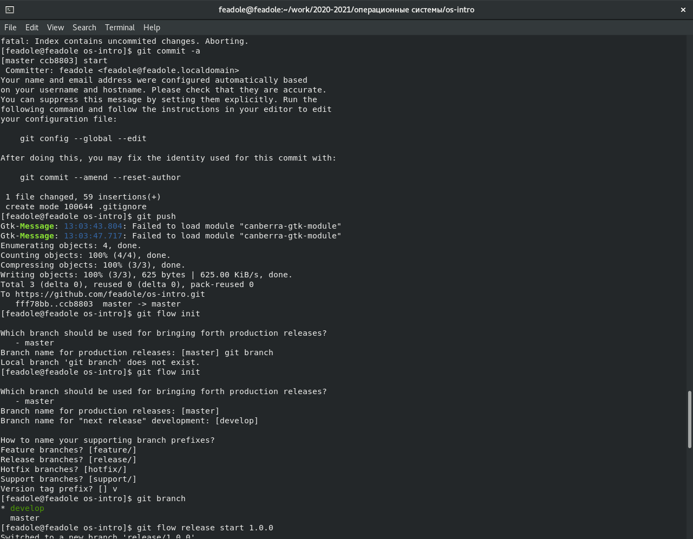
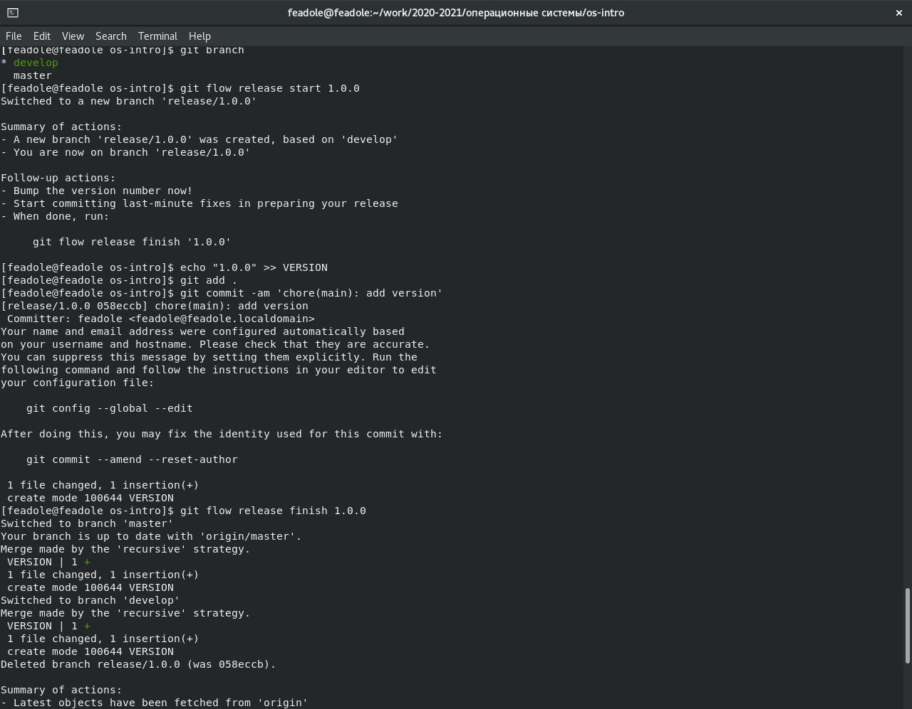

## Отчёт о выполнении лабораторной работы №2 Управление версиями

# Российский Университет Дружбы Народов

# Факульткт Физико-Математических и Естественных Наук

Дисциплина: Операционные системы

Работу выполняла: Адоле Фейт

1032205074

НПМбд-01-20

Москва. Дисплейный класс РУДН. 2021г.

## Цель работы

Изучить идеологию и применение средств контроля версий.

## Задание

1.	Создайте учётную запись на https://github.com.

2.	Настройте систему контроля версий git, как это описано выше c использованием сервера репозиториев https://github.com/.

3.	Создайте структуру каталога лабораторных работ согласно пункту М.2.

4.	Подключение репозитория к github

– Создайте репозиторий на GitHub. Для примера назовём его os-intro.

– Рабочий каталог будем обозначать как laboratory. Вначале нужно перейти в этот каталог:

– Инициализируем системы git:

– Создаём заготовку для файла README.md:

echo "# Лабораторные работы" >> README.md

git add README.md

– Делаем первый коммит и выкладываем на github: git commit -m "first commit"

git remote add origin

↪ git@github.com:/sciproc-intro.git 5. Первичная конфигурация

– Добавим файл лицензии: wget https://creativecommons.org/licenses/by/4.0/legalcode.txt

– Добавим шаблон игнорируемых файлов. Просмотрим список имеющихся шаблонов: curl -L -s https://www.gitignore.io/api/list

Затем скачаем шаблон, например, для C:

curl -L -s https://www.gitignore.io/api/c >> .gitignore

Можно это же сделать через web-интерфейс на сайте https://www.gitignore. io/. – Добавим новые файлы:

git add .
 

– Выполним коммит: git commit -a

– Отправим на github: git push

6. Конфигурация git-flow

– Инициализируем git-flow git flow init

Префикс для ярлыков установим в v.

– Проверьте, что Вы на ветке develop: git branch

– Создадим релиз с версией 1.0.0

git flow release start 1.0.0

– Запишем версию: echo "1.0.0" >> VERSION

– Добавим в индекс:

git add .

git commit -am 'chore(main): add version'

– Зальём релизную ветку в основную ветку git flow release finish 1.0.0

– Отправим данные на github

git push --all

git push --tags

– Создадим релиз на github.

Выполнение работы

1.	Создала учётную запись на https://github.com.

2.	Настройте систему контроля версий git добавила ssh ключ

– Создала репозиторий на GitHub и файл README.md.

3.	Первичная конфигурация

– Добавила файл лицензии:

– Добавила шаблон игнорируемых файлов. Просмотрела список имеющихся шаблонов:
Затем скачала шаблон, например, для C++:
Добавила новые файлы,
Выполнила коммит.
Отправила на github.

4.	Конфигурация git-flow Инициализировала git-flow Проверила, что я на ветке develop: Создала релиз с версией 1.0.0
Записала версию:

Добавила в индекс:

Залила релизную ветку в основную ветку
Отправила данные на github

Создадим релиз на github.

 

 

 

## контрольные вопросы

1.	Системы контроля версий (Version Control System, VCS) применяются при работе нескольких человек над одним проектом. Обычно основное дерево проекта хранится в локальном или удалённом репозитории, к которому настроен доступ для участников проекта. При внесении изменений в содержание проекта система контроля версий позволяет их фиксировать, совмещать изменения, произведённые разными участниками проекта, производить откат к любой более ранней версии проекта, если это требуется.

2.	В Git один коммит (англ. сommit) представляет из себя ссылку на объект tree, соответствующий корневой директории, и ссылку на родительский коммит (кроме самого первого коммита в репозитории). Также в коммите есть информация об авторе и UNIX timestamp от времени создания. В Git единицей хранения данных является объект (англ. object), который однозначно определяется 40-символьным хешем sha1. В объектах Git хранит почти всё: коммиты, содержимое файлов, их иерархию. Сначала объекты представляют из себя обычные файлы в папке .git/objects, а после git gc упаковываются в .pack-файлы, о которых будет рассказано чуть ниже. Для экономии дискового пространства содержимое всех объектов дополнительно сжимается с помощью zlib. В Git нет отдельного хранилища истории. Всю историю можно развернуть, но лишь пройдя по ссылкам на родителя из нужного вам коммита. Если необходимо просмотреть историю только по одному файлу (или по поддиректории), Git всё равно должен проделать то же самое, но он будет возвращать отфильтрованные результаты. Стоит иметь это ввиду, когда вы делаете интеграцию с Git, и не заставлять Git делать полный просмотр истории на каждый файл. Рабочая копия является снимком одной версии проекта. Эти файлы извлекаются из сжатой базы данных в каталоге Git и помещаются на диск, для того чтобы их можно было использовать или редактировать.

3.	В отличие от классических, в распределённых системах контроля версий центральный репозиторий не является обязательным. Среди классических VCS наиболее известны CVS, Subversion, а среди распределённых — Git, Bazaar, Mercurial. Принципы их работы схожи, отличаются они в основном синтаксисом используемых в работе команд.

4.	Участник проекта (пользователь) перед началом работы посредством определённых команд получает нужную ему версию файлов. После внесения изменений, пользователь размещает новую версию в хранилище. При этом предыдущие версии не удаляются из центрального хранилища и к ним можно вернуться в любой момент.

5.	Участник проекта (пользователь) перед началом работы посредством определённых команд получает нужную ему версию файлов. После внесения изменений, пользователь размещает новую версию в хранилище. При этом предыдущие версии не удаляются из центрального хранилища и к ним можно вернуться в любой момент.

6.	Задачи решаемые git: Как не потерять файлы с исходным кодом? Как защититься от случайных исправлений и удалений? Как отменить изменения, если они оказались некорректными? Как одновременно поддерживать рабочую версию и разработку новой?

7.	– создание основного дерева репозитория: git init

– получение обновлений (изменений) текущего дерева из центрального репозитория:

git pull

– отправка всех произведённых изменений локального дерева в центральный репозиторий: git push

– просмотр списка изменённых файлов в текущей директории:
 

 

git status

– просмотр текущих изменения: git diff

– сохранение текущих изменений:

– добавить все изменённые и/или созданные файлы и/или каталоги: git add .

– добавить конкретные изменённые и/или созданные файлы и/или каталоги: git add имена_файлов

– удалить файл и/или каталог из индекса репозитория (при этом файл и/или каталог остаётся в локальной директории):

git rm имена_файлов

– сохранение добавленных изменений:

– сохранить все добавленные изменения и все изменённые файлы:

git commit -am 'Описание коммита'

– сохранить добавленные изменения с внесением комментария через встроенный редактор: git commit

8.	git push --all

9.	Ветви функциональностей (feature branches), также называемые иногда тематическими ветвями (topic branches), используются для разработки новых функций, которые должны появиться в текущем или будущем релизах.

10.	Игнорируемые файлы – это, как правило, специфичные для платформы файлы или автоматически созданные файлы из систем сборки. Некоторые общие примеры включают в себя: Файлы времени выполнения, такие как журнал, блокировка, кэш или временные файлы. Файлы с конфиденциальной информацией, такой как пароли или ключи API. Скомпилированный код, такой как .class или .o.

Каталоги зависимостей, такие как /vendor или /node_modules. Создавать папки, такие как /public, /out или /dist.

Системные файлы, такие как .DS_Store или Thumbs.db Конфигурационные файлы IDE или текстового редактора.

# Вывод

Изучила идеологию и применение средств контроля версий. Создала аккаунт и репозиторий на github. Выполнила важнейшие команды.

 

