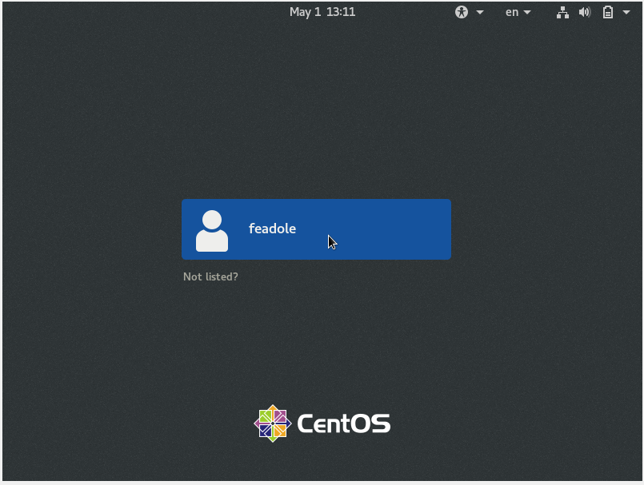
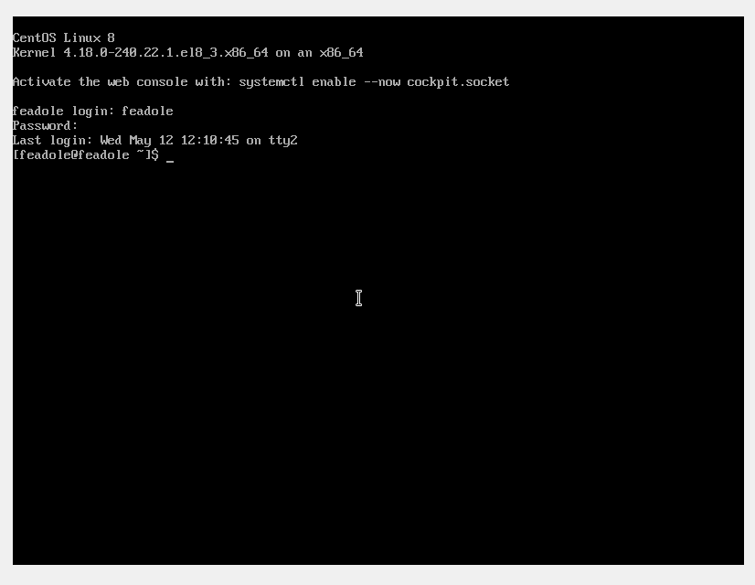
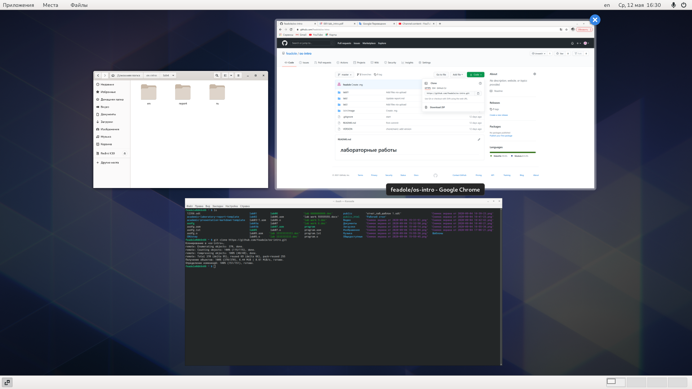
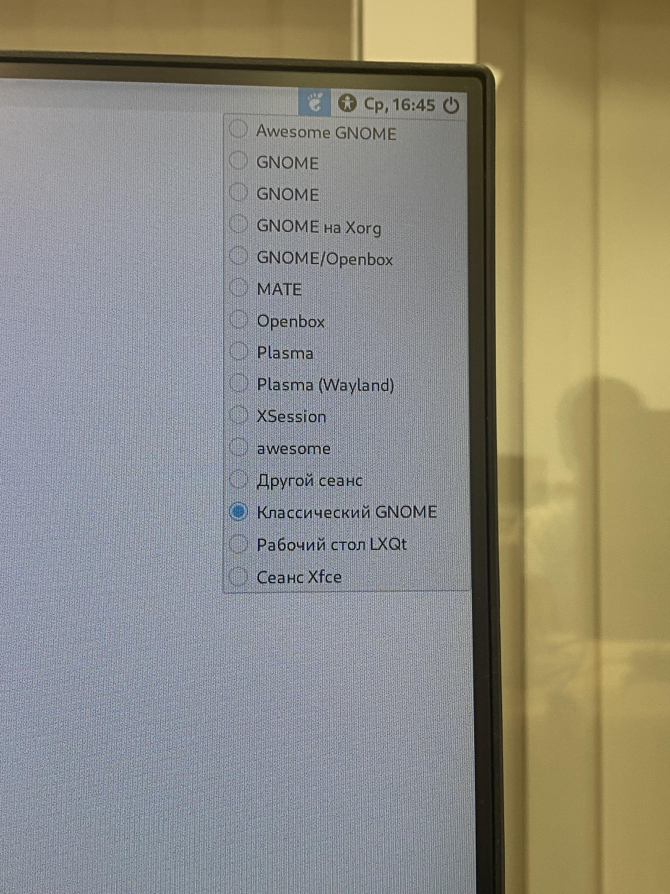

---
# Front matter
lang: ru-RU
title: "Шаблон отчёта по лабораторной работе"
subtitle: "Операционные Системы"
author: "Адоле Фейт"
std. number: "1032205074"
Group: "НПМбд-01-20"

# Formatting
toc-title: "Содержание"
toc: true # Table of contents
toc_depth: 2
lof: true # List of figures
lot: true # List of tables
fontsize: 12pt
linestretch: 1.5
papersize: a4paper
documentclass: scrreprt
polyglossia-lang: russian
polyglossia-otherlangs: english
mainfont: PT Serif
romanfont: PT Serif
sansfont: PT Sans
monofont: PT Mono
mainfontoptions: Ligatures=TeX
romanfontoptions: Ligatures=TeX
sansfontoptions: Ligatures=TeX,Scale=MatchLowercase
monofontoptions: Scale=MatchLowercase
indent: true
pdf-engine: lualatex
header-includes:
  - \linepenalty=10 # the penalty added to the badness of each line within a paragraph (no associated penalty node) Increasing the value makes tex try to have fewer lines in the paragraph.
  - \interlinepenalty=0 # value of the penalty (node) added after each line of a paragraph.
  - \hyphenpenalty=50 # the penalty for line breaking at an automatically inserted hyphen
  - \exhyphenpenalty=50 # the penalty for line breaking at an explicit hyphen
  - \binoppenalty=700 # the penalty for breaking a line at a binary operator
  - \relpenalty=500 # the penalty for breaking a line at a relation
  - \clubpenalty=150 # extra penalty for breaking after first line of a paragraph
  - \widowpenalty=150 # extra penalty for breaking before last line of a paragraph
  - \displaywidowpenalty=50 # extra penalty for breaking before last line before a display math
  - \brokenpenalty=100 # extra penalty for page breaking after a hyphenated line
  - \predisplaypenalty=10000 # penalty for breaking before a display
  - \postdisplaypenalty=0 # penalty for breaking after a display
  - \floatingpenalty = 20000 # penalty for splitting an insertion (can only be split footnote in standard LaTeX)
  - \raggedbottom # or \flushbottom
  - \usepackage{float} # keep figures where there are in the text
  - \floatplacement{figure}{H} # keep figures where there are in the text
---

# Цель работы

Познакомиться с операционной системой Linux, получить практические навыки рабо-
ты с консолью и некоторыми графическими менеджерами рабочих столов операционной
системы.

# Задание

1. Ознакомиться с теоретическим материалом.
2. Загрузить компьютер.
3. Перейти на текстовую консоль. Сколько текстовых консолей доступно на вашем ком-
пьютере?
4. Перемещаться между текстовыми консолями. Какие комбинации клавиш необходимо
при этом нажимать?
5. Зарегистрироваться в текстовой консоли операционной системы. Какой логин вы при
этом использовали? Какие символы отображаются при вводе пароля?
6. Завершить консольный сеанс. Какую команду или комбинацию клавиш необходимо
для этого использовать?
7. Переключиться на графический интерфейс. Какую комбинацию клавиш для этого
необходимо нажать?
8. Ознакомиться с менеджером рабочих столов. Как называется менеджер, запускаемый
по умолчанию?
9. Поочерёдно зарегистрироваться в разных графических менеджерах рабочих столов
(GNOME, KDE, XFCE) и оконных менеджерах (Openbox). Продемонстрировать разницу
между ними, сделав снимки экрана (скриншоты). Какие графические менеджеры
установлены на вашем компьютере?
10. Изучить список установленных программ. Обратить внимание на предпочтитель-
ные программы для разных применений. Запустите поочерёдно браузер, текстовой
редактор, текстовой процессор, эмулятор консоли. Укажите названия программ.

# Выполнение лабораторной работы
1. Ознакомилась с теоретическим материалом.
2. Загрузила компьютер.

3. Перешла на текстовую консоль.  Она выглядит как командная строка. На моем компьютере доступно 6 текстовых консолей.

4. Переместилась между текстовыми консолями, нажимая комбинацию клавиш *ALT+(F1-F6).
5. Зарегистрировалась в текстовой консоли операционной системы, используя свой логин и пароль.
6. Завершила консольный сеанс, используя команду *logout* или сочетание клавиш *ctrl + Alt + Fn*.
7. Переключилась на графический интерфейс, используя комбинацию клавиш *Ctrl + alt + F7*.
8. Ознакомилась с менеджером рабочих столов. Менеджер, запускаемый
по умолчанию называется GNOME

9. Поочерёдно зарегистрировалась в разных графических менеджерах рабочих столов
(GNOME, KDE, XFCE) и оконных менеджерах (Openbox). На моем компьютере установлены следующие графические менеджеры...

- XFCE не подключено
- KDE не установлено

10. Изучила список установленных программ. Обратила внимание на предпочтительные программы для разных применений. Запустите поочерёдно браузер, текстовой
редактор, текстовой процессор, эмулятор консоли.  

# Контрольные вопросы

1. Компьютерный терминал—устройство ввода–вывода,основные функ-ции которого заключаются в вводе и отображении данных. Текстовый терминал (терминал,текстовая консоль)—интерфейс ком-пьютера для последовательной передачи данных. По моему мнению графический интерфейс понятнее. 

2. Входное имя - название учётной записи пользователя, которое нужно вводить при регистрации пользователя в системе.  

3. Пароли пользователей хранятся в зашифрованном виде в файле /etc/shadow. Файл /etc/shadow доступен только для чтения и может читаться исключительно пользователем root. В разделе, посвященном правам доступа к файлам, мы поговорим о том, как пользователям удается изменять свои пароли.  

4. Операционная система Linux в отличие от Windows не имеет общего реестра для хранения настроек системы, все настройки хранятся в конфигурационных файлах.  Большинство этих файлов размещено в папке /etc/. Настройки большинства системных и сторонних программ находятся в этих файлах, это могут быть настройки  графического сервера, менеджера входа, системных служб, веб-сервера, системы инициализации.  

5. УчётнаязаписьпользователясUID=0называетсяrootиприсутствуетвлюбойсистеметипа Linux.Пользовательrootимеет права администратора и может выполнятьлюбыедействия в системе.  

6. да  

7. Процедура регистрации в системе обязательна для Linux.Каждый пользователь опе-рационный системы имеет определенные ограничения на возможные с его стороныдействия:чтение,изменение,запускфайлов,атакжена ресурсы: пространствона файло-вой системе,процессорное время для выполнениетекущих задач (процессов).При этомдействия одного пользователя не влияютна работудругого.Такая модельразграничениядоступа к ресурсам операционной системы получила названиемногопользовательской  

8. Учётная запись пользователя содержит:  

    –входное имя пользователя (Login Name);  

    –пароль (Password);  

    –внутренний идентификатор пользователя (User ID);  

    –идентификатор группы (Group ID);  

    –анкетные данные пользователя (General Information);  

    –домашний каталог (Home Dir);  

    –указатель на программную оболочку (Shell)  

9. Внутренний идентификаторпользователя в системе (User ID,UID) Group ID(GID).   

11. Анкетные данные пользователя (General Information или GECOS)являются необяза-тельным параметром учётной записи и могут содержать реальное имя пользователя(фамилию,имя),адрес,телефон.  

12. Домашний каталог - директория в Unix-подобныхоперационныхсистемах , содержащая домашние директории пользователей . В домашних директориях хранятся документы и настройки пользователя.  
 
13. /home  

14. да  

15. Учётные записи пользователей хранятся в файле/etc/passwd,который имеет следу-ющую структуру:login:password:UID:GID:GECOS:home:shel  

16. Символ * в полеpasswordнекоторой учётной записи в файле/etc/passwdозначает,что пользователь не сможетвойти в систему.  

17. Виртуальные консоли— реализация концепции многотерминальнойработы в рамках одного устройства.  

18.  getty (сокращение от get teletype) — программа для UNIX-подобных операционных систем, управляющая доступом к физическим и виртуальным терминалам (tty).  

19. Сеанс (от фр. séance — заседание, букв. «присест»), сессия — в информационных технологиях — период работы учётной записи пользователя между авторизацией и её завершением. В информационных системах сеанс представляет собой запись факта авторизации пользователя и, в некоторых системах, запись времени автоматического завершения работы.  

20. Toolkit (Tk,«набор инструментов»,«инструментарий»)—кроссплатфор-менная библиотека базовых элементов графического интерфейса, распространяемаяс открытыми исходнымитекстами
Используются следующие основныетулкиты:  

–GTK+ (сокращение от GIMP Toolkit) — кроссплатформенная библиотека элементовинтерфейса;  

–Qt—кросс-платформенный инструментарий разработки программного обеспеченияна языке программирования C++.GTK+ состоит из двух компонентов:  

–GTK—содержит набор элементов пользовательского интерфейса (таких,как кнопка,список,поле для вводатекста ит.п.) для различных задач;  

–GDK — отвечает за вывод информации на экран, может использовать для этогоX Window System,Linux Framebuffer,WinAPI.На основе GTK+ построены рабочие окружения GNOME,LXDE и Xfce. Естественно,этитулкиты могут использоваться и за пределами «родных» десктопныхокружений.Qt используется в среде KDE (Kool Desktop Environment)  

## Вывод
> Познакомилась с операционной системой Linux, получила практические навыки работы с консолью и некоторыми графическими менеджерами рабочих столов операционной системы. Оценила и сравнила разные графические среды. Воспользовалась виртуальной консолью.

