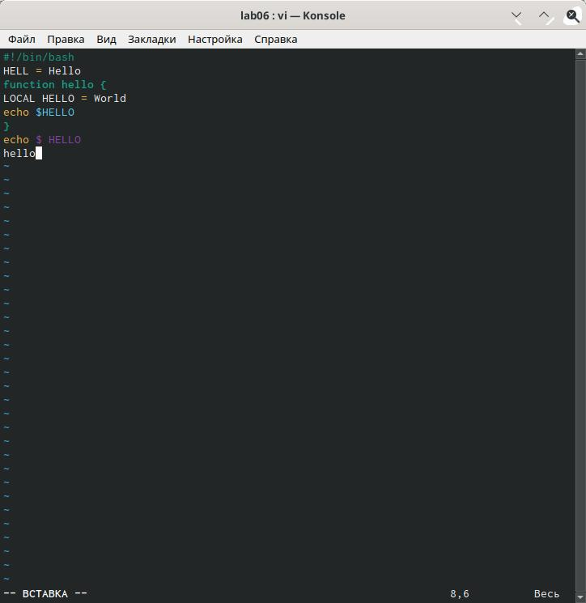

---
## Front matter
lang: ru-RU
title: Structural approach to the deep learning method
author: |
	Адоле Фейт
institute: |
	Российский Университет Дужбы Народов
date: Москва, 2021
## Formatting
toc: false
slide_level: 2
theme: metropolis
header-includes: 
 - \metroset{progressbar=frametitle,sectionpage=progressbar,numbering=fraction}
 - '\makeatletter'
 - '\beamer@ignorenonframefalse'
 - '\makeatother'
aspectratio: 43
section-titles: true
---

# Операционные Системы

## Цель Работы

Познакомиться с операционной системой Linux. Получить практические навыки работы с редактором vi, установленным по умолчанию практически во всех дистрибутивах.

## Задача

- Ознакомиться с теоретическим материалом.
- Ознакомиться с редактором vi.
- Выполнить упражнения, используя команды vi.

## Выполнение Работы
В ходе лабораторных работ я ознакомился с теоретическим материалом курса. А также использовалa человека в команде, чтобы прочитать о vi. Я использовалa знания из всего вышеперечисленного, чтобы успешно завершить свои лабораторные работы.

## Вывод

Познакомился с операционной системой Linux.А также, я получилa практические навыки работы с редактором vi, установленным по умолчанию практически во всех дистрибутивах.

# Спасибо за внимание

