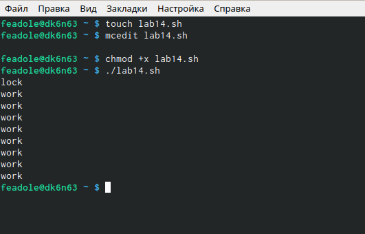
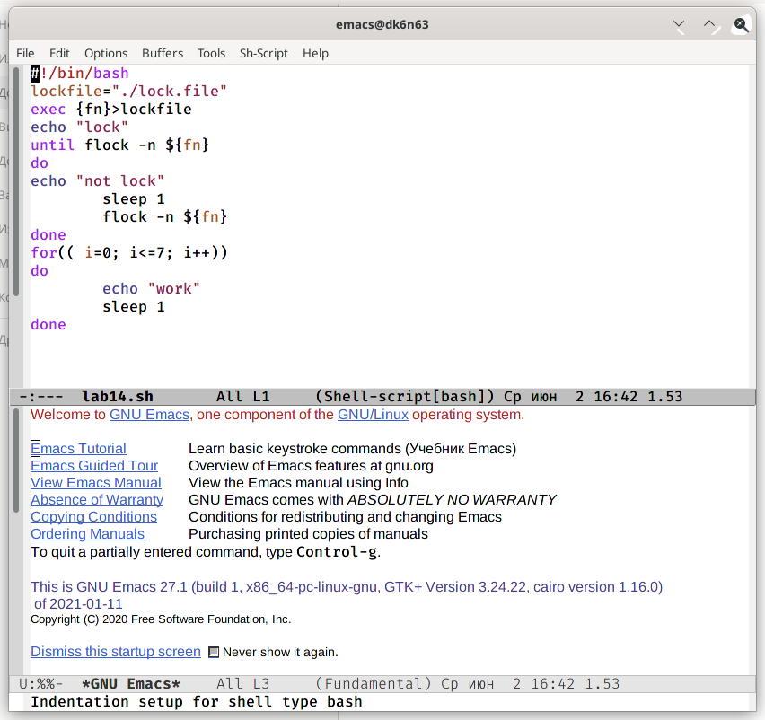

---
## Front matter
lang: ru-RU
title: Лаборатонная Работа № 13
author: |
	Адоле Фейт
institute: |
	Российский Университет Дужбы Народов
date: Москва, 2021

## Formatting
toc: false
slide_level: 2
theme: metropolis
header-includes: 
 - \metroset{progressbar=frametitle,sectionpage=progressbar,numbering=fraction}
 - '\makeatletter'
 - '\beamer@ignorenonframefalse'
 - '\makeatother'
aspectratio: 43
section-titles: true
---

# Операционные Системы

## Цель Работы

Изучить основы программирования в оболочке ОС UNIX. Научиться писать более сложные командные файлы с использованием логических управляющих конструкций и циклов.

## Задача

-Изучилa основы программирования в оболочке UNIX.
-Научилась писать более сложные командные файлы, используя логические управляющие структуры и циклы.

## Выполнение Работы
 
Изучилa основы программирования в оболочке UNIX. Научился писать более сложные командные файлы, используя логические управляющие структуры и циклы.
Теперь я знаю основы программирования в оболочке UNIX. Я использовалa его для написания более сложных командных файлов с использованием логических структур управления и циклов.

## Вывод

Мы изучили основы программирования в оболочке ОС UNIX, а также научилисуь писать более сложные командные файлы с использованием логических управляющих конструкций и циклов.

## Спасибо за внимание

 
