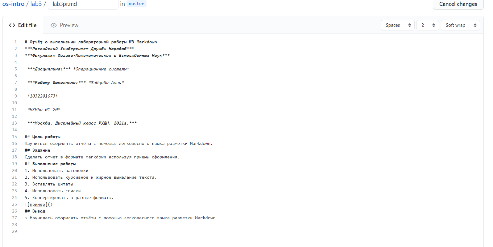

# Отчёт о выполнении лабораторной работы №6 Анализ файловой системы Linux. Команды для работы с файлами и каталогами
***Российский Университет Дружбы Народов***  
***Факульткт Физико-Математических и Естественных Наук***  

 ***Дисциплина:*** *Операционные системы*  
 
 ***Работу выполняла:*** *Адоле Фейт*  
 
 *1032205074*  
 
 *НПНбд-01-20*  
 
 ***Москва. Дисплейный класс РУДН. 2021г.***  
 
 ---

 В ходе изучения курса "Операционные системы" передо мной встала следующая задача
 > *Ознакомление с файловой системой Linux, её структурой, именами и содержанием каталогов. Приобретение практических навыков по применению команд для работы с файлами и каталогами, по управлению процессами (и работами), по проверке использования диска и обслуживанию файловой системы.*
 
 ---
 Данная задача была разбита на следующие подзадачи:
- овладеть перемещением, копированием и переименованием файлов и каталогов через консоль.
- Открывать файлы в различных форматах, настаивать права доступа
- Работать с файловой системой.

 Изучив теоретический материал, мне удалось достигнуть поставленных целей.

 --- 

Сейчас я могу проделывать все важнейшие операции через консоль.

 

 ---
 
 # Вывод
 В хоте работы я приобрела ряд полезных навыков обращения с командной строкой и файловой системой и главное создала базу для выполнения следующих лабораторных работ.

